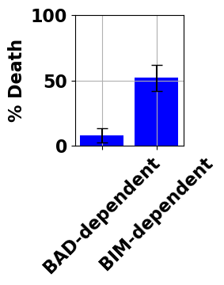

# BIM-Dependent Inhibition of ERK signaling

**Benchmark Author(s): Erdem C, Birtwistle MR, Huggins JR**

**Date Created: 01/31/2024**

**Version: 1.0**

## Summary

"Simulations where either BAD- or BIM-dependent mechanisms were computationally knocked-out predicted BIM to account for most ERK and AKT inhibition effects. Independent experimental data corroborate this prediction; MCF10A cell detachment-induced death, which depends on such survival signaling mechanisms, has been observed to be predominantly controlled by BIM rather than BAD. The model suggests several contributing mechanisms. One reason is expression levels; BAD is lowly expressed compared to anti-apoptotic BCL2 family proteins (~14,000 vs. ~61,000 molecules per cell), and thus is unlikely to exert significant control over cell death. Another is the cascade network structure for BIM regulation. If only AKT is inhibited, phosphorylation by ERK blocks the accumulation of active BIM. If only ERK is inhibited, the amount of BIM in the cell, even if completely unphosphorylated, is largely insufficient to drive cell death in the absence of further strong death signals. However, when both pathways are inhibited, the production and accumulation of active BIM proceeds uninhibited, thus creating a potent apoptotic signal. Furthermore, the inhibition of these activities must be coordinated over relatively long periods of time, with duration of AKT inhibition having enough overlap with that of ERK to cause both the accumulation and activation of BIM."

    - A mechanistic pan-cancer pathway model informed by multi-omics data interprets stochastic cell fate responses to drugs and mitogens [1]

References:

1. Bouhaddou M, Barrette AM, Stern AD, Koch RJ, DiStefano MS, Riesel EA, Santos LC, Tan AL, Mertz AE, Birtwistle MR. A mechanistic pan-cancer pathway model informed by multi-omics data interprets stochastic cell fate responses to drugs and mitogens. PLoS Comput Biol. 2018 Mar 26;14(3):e1005985. doi: 10.1371/journal.pcbi.1005985. Erratum in: PLoS Comput Biol. 2018 Jul 9;14(7):e1006189. doi: 10.1371/journal.pcbi.1006189. PMID: 29579036; PMCID: PMC5886578.

## Benchmark Reports:
